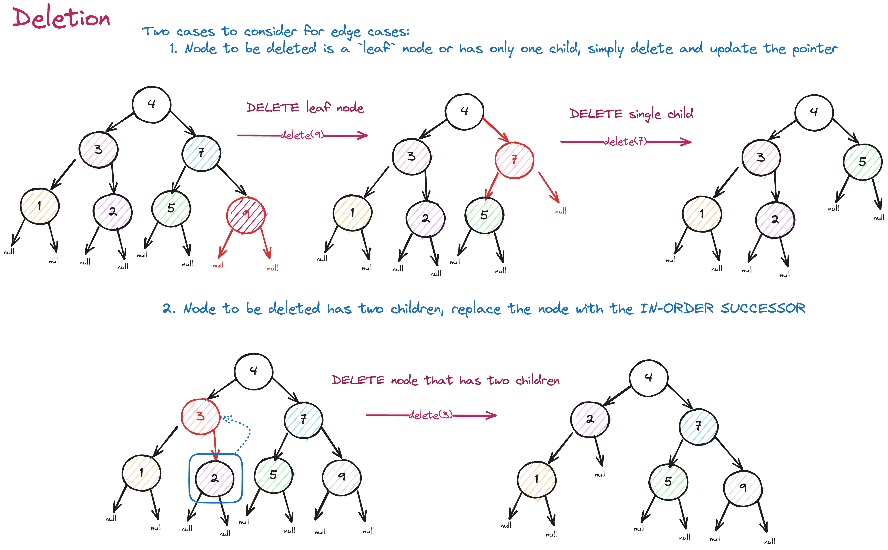

# Solving LeetCode Problems

For this collection of problems, I will be solving the infamous **Blind 75 Leetcode questions**.
Check out my portfolio on [Medium](https://medium.com/@kitanatoft) to see my break down of general Data Structures & Algorithms. More to come!

## Array

- [x] [Contains Duplicate](https://leetcode.com/problems/contains-duplicate/)
- [x] [Valid Anagram](https://leetcode.com/problems/valid-anagram/)
- [x] [Two Sum](https://leetcode.com/problems/two-sum/)
- [x] [Best Time to Buy and Sell Stock](https://leetcode.com/problems/best-time-to-buy-and-sell-stock/)
- [x] [Product of Array Except Self](https://leetcode.com/problems/product-of-array-except-self/)
- [x] [Maximum Subarray](https://leetcode.com/problems/maximum-subarray/)
- [x] [3Sum](https://leetcode.com/problems/3sum/)
- [x] [Container With Most Water](https://leetcode.com/problems/container-with-most-water/)
- [x] [Find Minimum in Rotated Sorted Array](https://leetcode.com/problems/find-minimum-in-rotated-sorted-array/)
- [x] [Search in Rotated Sorted Array](https://leetcode.com/problems/search-in-rotated-sorted-array/)

---

## Sorting Algorithms

### [Merge Sort](https://medium.com/@kitanatoft/merge-sort-explained-93a6bad7cccb)

- [x] [Sort an Array](https://leetcode.com/problems/sort-an-array/)
- [x] [Merge Two Sorted Lists](https://leetcode.com/problems/merge-two-sorted-lists/description/)
- [x] [Merge K Sorted Lists](https://leetcode.com/problems/merge-k-sorted-lists/)
<!-- TODO: Use a heap next time for Merge K Sorted Lists-->

---

## [Sliding Window](https://medium.com/@kitanatoft/sliding-window-technique-explained-653a011d1eae)

- [X] [Contains Duplicate II](https://leetcode.com/problems/contains-duplicate-ii/)
- [X] [Longest Substring Without Repeating Characters](https://leetcode.com/problems/longest-substring-without-repeating-characters/)
- [X] [Number of Sub-arrays of Size K and Average Greater than or Equal to Threshold](https://leetcode.com/problems/number-of-sub-arrays-of-size-k-and-average-greater-than-or-equal-to-threshold/)
- [X] [Longest Repeating Character Replacement](https://leetcode.com/problems/longest-repeating-character-replacement/)
- [X] [Permutation in String](https://leetcode.com/problems/permutation-in-string/)
- [X] [Minimum Window Substring](https://leetcode.com/problems/minimum-window-substring/)
- [X] [Sliding Window Maximum](https://leetcode.com/problems/sliding-window-maximum/)

---

## [Binary Search](https://medium.com/@kitanatoft/binary-search-explained-a46ea6e2ae35)

- [x] [Binary Search](https://leetcode.com/problems/binary-search/)
- [x] [Search a 2D Matrix](https://leetcode.com/problems/search-a-2d-matrix/)
- [x] [Guess Number Higher or Lower](https://leetcode.com/problems/guess-number-higher-or-lower/)
- [x] [First Bad Version](https://leetcode.com/problems/first-bad-version/)
- [x] [Koko Eting Bananas](https://leetcode.com/problems/koko-eating-bananas/)

---

## [Linked List](https://medium.com/@kitanatoft/linked-list-explained-ee6fd9c4f418)

- [x] [Reorder List](https://leetcode.com/problems/reorder-list/)
- [x] [Reverse a Linked List](https://leetcode.com/problems/reverse-linked-list/)
- [x] [Remove Nth Node From End Of List](https://leetcode.com/problems/remove-nth-node-from-end-of-list/)
- [x] [Maximum Twin Sum of a Linked List](https://leetcode.com/problems/maximum-twin-sum-of-a-linked-list/)
- [x] [Linked List Cycle](https://leetcode.com/problems/linked-list-cycle/)
- [x] [Linked List Cycle II](https://leetcode.com/problems/linked-list-cycle-ii/)
- [x] [Merge Two Sorted Lists](https://leetcode.com/problems/merge-two-sorted-lists/)
- [x] [Merge K Sorted Lists](https://leetcode.com/problems/merge-k-sorted-lists/)

---

## Tree

- [x] [Search in a Binary Search Tree](https://leetcode.com/problems/search-in-a-binary-search-tree/)
- [x] [Invert/Flip Binary Tree](https://leetcode.com/problems/invert-binary-tree/)
- [x] [Insert into a Binary Search Tree](https://leetcode.com/problems/insert-into-a-binary-search-tree/)
- [x] [Delete Node in a BST](https://leetcode.com/problems/delete-node-in-a-bst/)
- [x] [Maximum Depth of Binary Tree](https://leetcode.com/problems/maximum-depth-of-binary-tree/)
- [x] [Same Tree](https://leetcode.com/problems/same-tree/)
- [x] [Binary Tree Level Order Traversal](https://leetcode.com/problems/binary-tree-level-order-traversal/)
- [x] [Kth Smallest Element in a BST](https://leetcode.com/problems/kth-smallest-element-in-a-bst/)
- [x] [Construct Binary Tree from Preorder and Inorder Traversal](https://leetcode.com/problems/construct-binary-tree-from-preorder-and-inorder-traversal/)
- [x] [Binary Tree Level Order Traversal](https://leetcode.com/problems/binary-tree-level-order-traversal/)
- [x] [Binary Tree Right Side View](https://leetcode.com/problems/binary-tree-right-side-view/description/)
- [x] [Subtree of Another Tree](https://leetcode.com/problems/subtree-of-another-tree/)
- [x] [Path Sum](https://leetcode.com/problems/path-sum/)
- [ ] [Binary Tree Maximum Path Sum](https://leetcode.com/problems/binary-tree-maximum-path-sum/)
- [ ] [Serialize and Deserialize Binary Tree](https://leetcode.com/problems/serialize-and-deserialize-binary-tree/)
- [ ] [Validate Binary Search Tree](https://leetcode.com/problems/validate-binary-search-tree/)

- [ ] [Lowest Common Ancestor of BST](https://leetcode.com/problems/lowest-common-ancestor-of-a-binary-search-tree/)
- [ ] [Implement Trie (Prefix Tree)](https://leetcode.com/problems/implement-trie-prefix-tree/)
- [ ] [Add and Search Word](https://leetcode.com/problems/add-and-search-word-data-structure-design/)
- [ ] [Word Search II](https://leetcode.com/problems/word-search-ii/)

## Binary

- [ ] [Sum of Two Integers](https://leetcode.com/problems/sum-of-two-integers/)
- [ ] [Number of 1 Bits](https://leetcode.com/problems/number-of-1-bits/)
- [ ] [Counting Bits](https://leetcode.com/problems/counting-bits/)
- [ ] [Missing Number](https://leetcode.com/problems/missing-number/)
- [ ] [Reverse Bits](https://leetcode.com/problems/reverse-bits/)

---

## Dynamic Programming

<!-- TODO: go over Maximum Product Subarray another time soon -->
- [x] [Maximum Product Subarray](https://leetcode.com/problems/maximum-product-subarray/)
- [ ] [Climbing Stairs](https://leetcode.com/problems/climbing-stairs/)
- [ ] [Coin Change](https://leetcode.com/problems/coin-change/)
- [ ] [Longest Increasing Subsequence](https://leetcode.com/problems/longest-increasing-subsequence/)
- [ ] [Longest Common Subsequence](https://leetcode.com/problems/longest-common-subsequence/)
- [ ] [Word Break Problem](https://leetcode.com/problems/word-break/)
- [ ] [Combination Sum](https://leetcode.com/problems/combination-sum-iv/)
- [ ] [House Robber](https://leetcode.com/problems/house-robber/)
- [ ] [House Robber II](https://leetcode.com/problems/house-robber-ii/)
- [ ] [Decode Ways](https://leetcode.com/problems/decode-ways/)
- [ ] [Unique Paths](https://leetcode.com/problems/unique-paths/)
- [ ] [Jump Game](https://leetcode.com/problems/jump-game/)

---

## Graph

- [ ] [Clone Graph](https://leetcode.com/problems/clone-graph/)
- [ ] [Course Schedule](https://leetcode.com/problems/course-schedule/)
- [ ] [Pacific Atlantic Water Flow](https://leetcode.com/problems/pacific-atlantic-water-flow/)
- [ ] [Number of Islands](https://leetcode.com/problems/number-of-islands/)
- [ ] [Longest Consecutive Sequence](https://leetcode.com/problems/longest-consecutive-sequence/)
- [ ] [Alien Dictionary (Leetcode Premium)](https://leetcode.com/problems/alien-dictionary/)
- [ ] [Graph Valid Tree (Leetcode Premium)](https://leetcode.com/problems/graph-valid-tree/)
- [ ] [Number of Connected Components in an Undirected Graph (Leetcode Premium)](https://leetcode.com/problems/number-of-connected-components-in-an-undirected-graph/)

---

## Interval

- [ ] [Insert Interval](https://leetcode.com/problems/insert-interval/)
- [ ] [Merge Intervals](https://leetcode.com/problems/merge-intervals/)
- [ ] [Non-overlapping Intervals](https://leetcode.com/problems/non-overlapping-intervals/)
- [ ] [Meeting Rooms (Leetcode Premium)](https://leetcode.com/problems/meeting-rooms/)
- [ ] [Meeting Rooms II (Leetcode Premium)](https://leetcode.com/problems/meeting-rooms-ii/)

---

## Matrix

- [ ] [Set Matrix Zeroes](https://leetcode.com/problems/set-matrix-zeroes/)
- [ ] [Spiral Matrix](https://leetcode.com/problems/spiral-matrix/)
- [ ] [Rotate Image](https://leetcode.com/problems/rotate-image/)
- [ ] [Word Search](https://leetcode.com/problems/word-search/)

---

## String

- [ ] [Longest Substring Without Repeating Characters](https://leetcode.com/problems/longest-substring-without-repeating-characters/)
- [ ] [Longest Repeating Character Replacement](https://leetcode.com/problems/longest-repeating-character-replacement/)
- [ ] [Minimum Window Substring](https://leetcode.com/problems/minimum-window-substring/)
- [ ] [Valid Anagram](https://leetcode.com/problems/valid-anagram/)
- [ ] [Group Anagrams](https://leetcode.com/problems/group-anagrams/)
- [ ] [Valid Parentheses](https://leetcode.com/problems/valid-parentheses/)
- [ ] [Valid Palindrome](https://leetcode.com/problems/valid-palindrome/)
- [ ] [Longest Palindromic Substring](https://leetcode.com/problems/longest-palindromic-substring/)
- [ ] [Palindromic Substrings](https://leetcode.com/problems/palindromic-substrings/)
- [ ] [Encode and Decode Strings (Leetcode Premium)](https://leetcode.com/problems/encode-and-decode-strings/)

---

## Heap

- [ ] [Merge K Sorted Lists](https://leetcode.com/problems/merge-k-sorted-lists/)
- [ ] [Top K Frequent Elements](https://leetcode.com/problems/top-k-frequent-elements/)
- [ ] [Find Median from Data Stream](https://leetcode.com/problems/find-median-from-data-stream/)

---

## References & Other Notes

- [Big-O Cheat Sheet](https://www.bigocheatsheet.com/)

