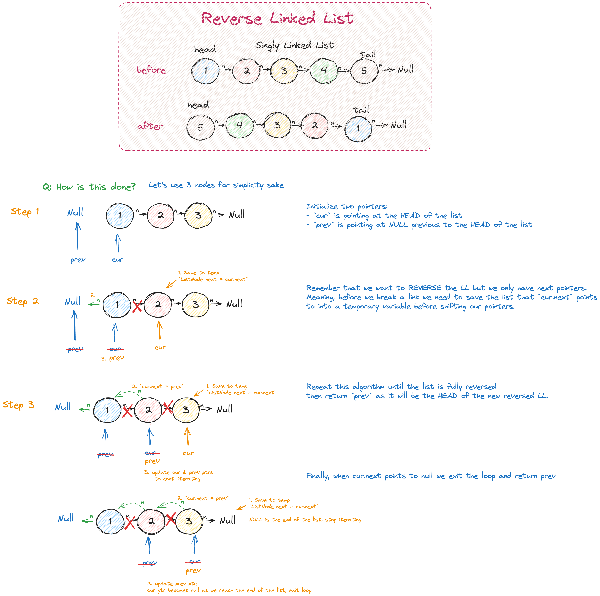

# Intuition

The problem "*[Reverse Linked List
](https://leetcode.com/problems/reverse-linked-list/)*" asks us to reverse a linked list.

Use a temp to store the current list as we iterate and use the two pointer method to traverse the list as we make updates.

# Approach

A **singly linked list** only has `next pointers`, therefore we are unable to simply look at any previous nodes. Which means we will need to store our list into a temp while we iterate. We can iterate over the list using the **two pointers** method. We

# Algorithm Steps



1. use two pointers to traverse the list, `cur` to track the current iteration and `prev` to track the previouly visited node (initially set to NULL).
2. While current is not null, iterate over the list values
    a. create a temp to hold `cur.next` so we don't lose the initial list since we only have `next` pointers (saves the current list)
    b. Set `cur.next` pointer equal to `prev`; this updates the reversed head to be equal to the most recent value added from the initial list
    c. Set `prev` equal to `cur` to move forward through the list
    d. Set `cur` equal to `next` (NOTE: loop ceases when cur is == null)
3. Return `prev` (thisis the nre head of the reversed linked list)

# Code

```java
public ListNode reverseList(ListNode head) {
    // use 3 pointers: cur, prev, & nxt
    ListNode cur = head;
    ListNode prev = null;

    while (cur != null) {
        // create temp to hold cur.next list values
        ListNode next = cur.next;

        // start reversing list
        cur.next = prev;

        // update ptrs each iteration
        prev = cur;
        cur = next;
    }
    return prev;
}
```

# Complexity

- **Time Compplexity**: `O(n)`, where `n` is the number of nodes in the list
- **Space Complexity**: `O(1)`, using pointers and no additional data structures
