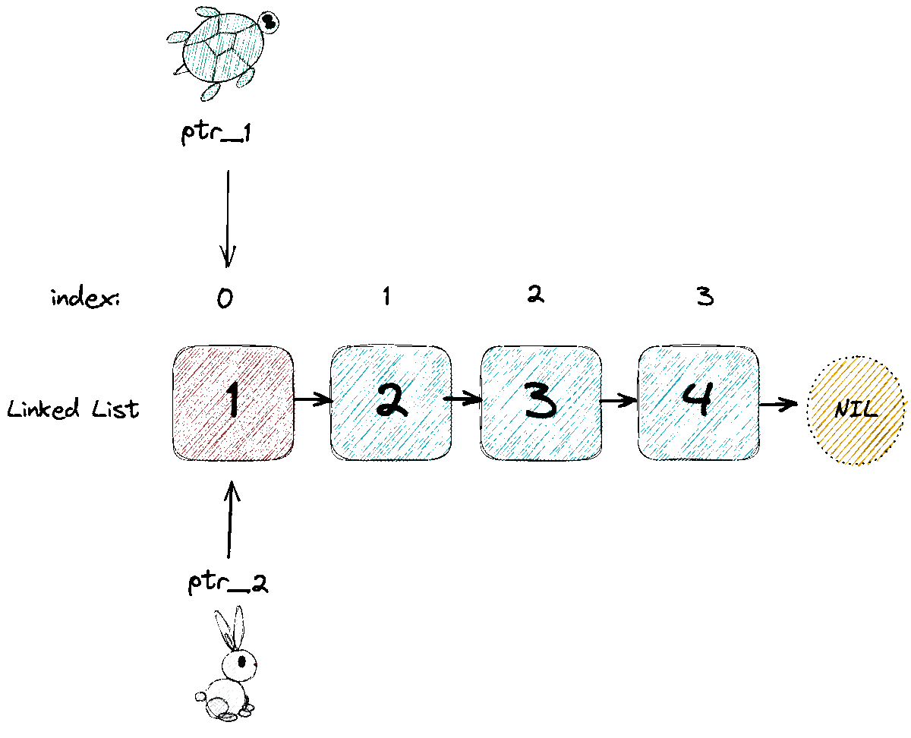
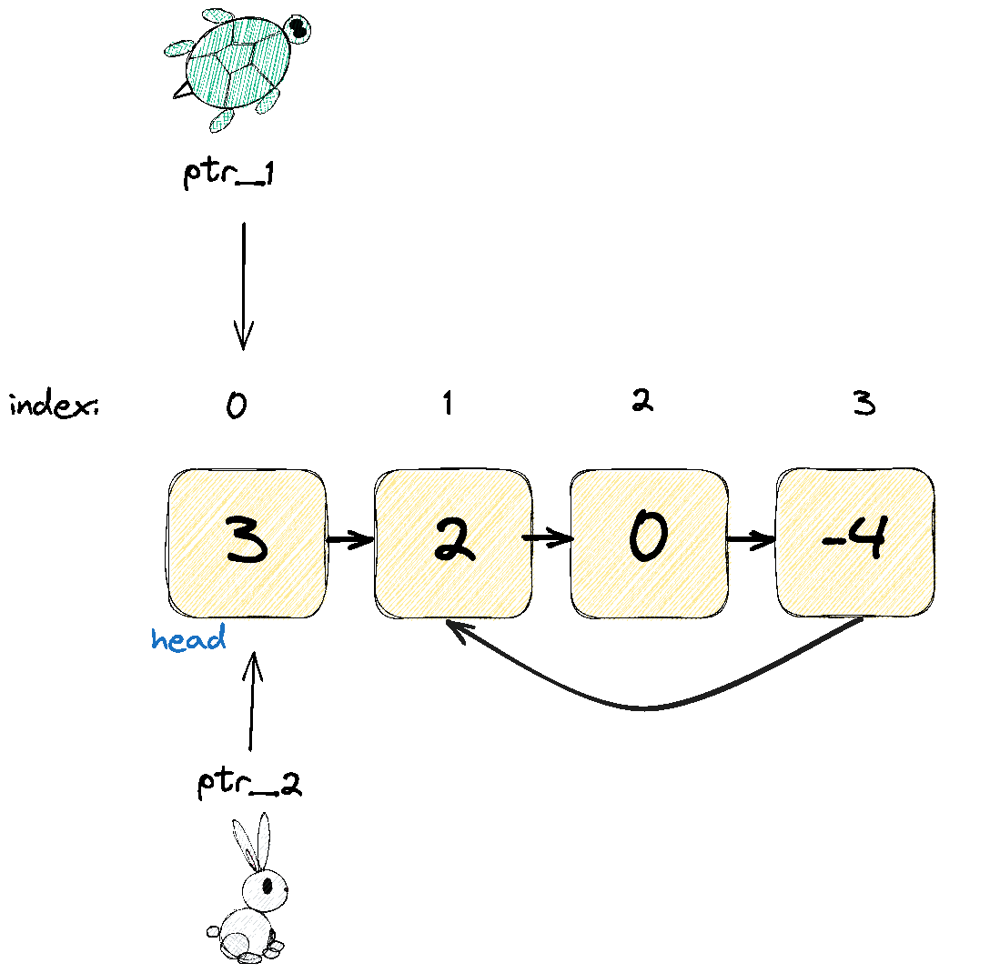

# Intuition

The problem "*Linked List Cycle*" asks us to determine if the linked list has a cycle in it or not given the `head` by returning a `bool`.
There is a cycle in a LL if there is some node in the list that can be reached again. Internally, `pos` is denoted as the tail of the list and is NOT passed in as a parameter.

To determine if there is a cycle in a linked list we can use two pointers, a **fast & slow pointer** (aka **Floyd's Cycle algorithm** or the **rabbit & tortoise,**), to verify if there is or isn't a cycle.

# Approach

We can use two pointers, `slow` and `fast`, which start at the head of the linked list. The `fast` pointer moves 2x the speed as the `slow` pointer.

If the `fast` pointer reaches the end of the linked list and is is NULL (e.g., `None`), then there is NO cycle and we would return `False`.



However, if there is a cycle, meaning that the tail node points to another node and continues looping, the `fast` pointer will eventually catch up to the `slow` pointer and both pointers will be pointing at the same node. In this case, we can return `True`.



# Algorithm Steps

1. Initialize two pointers, `slow` and `fast`, to the `head` of the linked list.
1. While the `slow` pointer is not `NULL` and its **next** pointer is not `NULL`, repeat steps 3-4.
1. Move the `fast` pointer two nodes ahead.
1. Move the `slow` pointer one node ahead.
1. If the `fast` and `slow` pointers point to the same node, return `True`.
1. If the `fast` pointer becomes `NULL`, return `False`.

# Code

```python
def hasCycle(self, head):
        """
        :type head: ListNode
        :rtype: bool
        """
        # Flyod's Cycle Algorithm
        slow, fast = head, head
        while fast and fast.next:
            slow = slow.next
            fast = fast.next.next
            # fast ptr cycles & catches up to slow ptr
            if slow == fast:
                return True
        # edge case: if next ptr is null return False
        return False
```

# Complexity

- **Time Compplexity**: `O(n)`,  where `n` is the number of nodes in the linked list. In the worst case scenario, we will need to traverse the entire list to determine if there is a cycle.
- **Space Complexity**: `O(1)`, as we are only using two pointers and not using any additional data structures.

