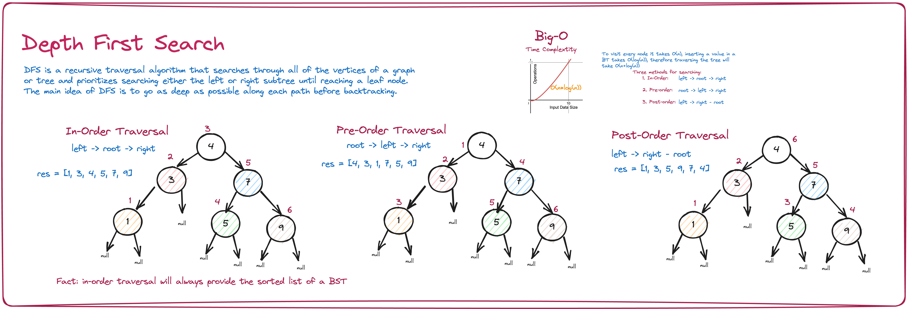
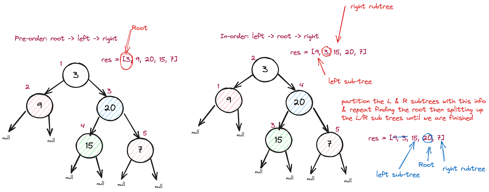

# Intuition

The problem "*[Construct Binary Tree from Preorder and Inorder Traversal](https://leetcode.com/problems/construct-binary-tree-from-preorder-and-inorder-traversal/)*" asks us to build a tree given the `inorder` and `preorder` traversal output.

# Approach



Since we are working with a BST, the `pre-order` traversal starts with the `root`. See below. We can figure out the `left` and `right` subtrees from this information using the `in-order`. Since we already know the root, all values to the left of the root are in the left subtree, likewise for all values to the right of the root belong in the right sub tree. We can continue finding the new parent node and splitting the list into two sublists until our tree is finished.

### Building the tree

Recall `pre-order` traversal visits nodes in the order of **root, left, right**.
Recall inorder an `in-order` traversal visits nodes in the order of **left, root, right**.

Thus

- the root of the subtree will always be the first element in pre-order.
- to construct the left subtree, we take all the nodes to the left of the root value (from in-order)
- to construct the right subtree, we take all the nodes to the right of the root (from in-order)

Simply

- **in-order** gives us the placement of the `root`
- **pre-order** gives us the placement of the `left` and `right` subtrees



To get the left and right subtreeswe need to find values from both the `inorder` and `preorder` output.

For the `inorder` array:

- going to the left, we want all nodes to the left of the root (e.g., `inorder[:root_index]`)
- going to the right, we want all nodes to the right of the root (e.g., `inorder[root_index + 1:]`)

For the `preorder` array:

- going to the left, we want all nodes that could eventually become a `root`, for a left subtree.
- going to the right, we want all nodes that could eventually become a `root`, for a right subtree.


# Algorithm Steps

1. always check for a null tree first
1. assign the `root` to be equal to the 0-index of the `preorder` list
1. assign the current midpoint to be equal to the `inorder` index of where the `root` from `preorder` is located
1. recursively start building the left and rigght subtrees using `buildTree` with the associated paramaters (see image example for reference)
1. return the modified root

# Code

```python
def buildTree(self, preorder, inorder):
  """
  :type preorder: List[int]
  :type inorder: List[int]
  :rtype: TreeNode
  """
  # base case: emptry BST
  if not preorder or not inorder:
      return None
  # first val in pre-order is the root node
  root = TreeNode(preorder[0])
  mid = inorder.index(preorder[0])
  # build subtree recursively using sublists
  root.left = self.buildTree(preorder[1:mid + 1], inorder[:mid])
  root.right = self.buildTree(preorder[mid + 1:], inorder[mid + 1:])
  return root
```

# Complexity

- **Time Compplexity**: `O(n)`, where `n` is the number of nodes in the tree.
- **Space Complexity**: `O(n)`, where `n` is the number of nodes in the tree.
