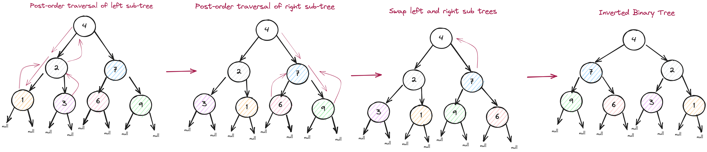

# Intuition

The problem "*[Invert Binary Tree](https://leetcode.com/problems/invert-binary-tree/)*" asks us to invert a binary tree given the root and return the intervted tree. A binary tree has at most two child nodes, `left` and `right`.

# Approach

My intuition tells me to use the **Depth First Search** algorithm - **Post-Order Traversal** and recursion.

# Algorithm Steps

1. Check for the base case: is the root null?
1. If it is not null, store the left and right child in variables
1. Use Post-order traversal, starting with the left subtree, then the right subtree, and finally return the parent
1. When we return to the parent node, we then can swap the left and right subtrees (inverting the tree)



# Code

```python
def invertTree(self, root):
        """
        :type root: TreeNode
        :rtype: TreeNode
        """
        # Base case: check if root is null
        if not root:
            return None
        # swap children DFS
        temp = root.left
        root.left = root.right
        root.right = temp

        # recursive call to both subtrees
        self.invertTree(root.left)
        self.invertTree(root.right)
        # return the root
        return root
```

# Complexity

- **Time Compplexity**: `O(n)`
- **Space Complexity**: `O(n)`, recursive stack space
