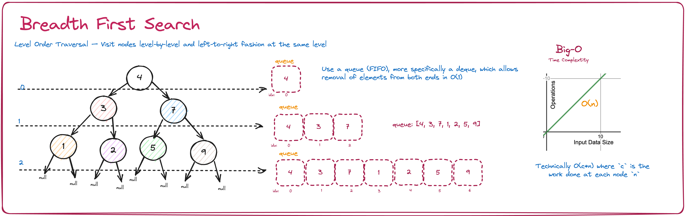

# Intuition

The problem "*[Binary Tree Level Order Traversal](https://leetcode.com/problems/binary-tree-level-order-traversal/)*" asks us to return the level order traversal of its nodes.

Ding, ding, ding! BFS should come to mind.

# Approach

Use Breadth First Search algorithm and save the nodes to a queue for each level visited.



# Algorithm Steps

1. check if non-null
1. create a result list to append to
1. iterate until there are no node left
  a. for each level, append nodes to it using popleft (pythoon dequeeu, double ended queue)
  b. add all the children nodes
  c. append the nodes from that lvel to the result list
1. returh the result list

# Code

```python
def levelOrder(self, root):
        """
        :type root: TreeNode
        :rtype: List[List[int]]
        """
        # init empty queue and res list
        res = []
        q = collections.deque()
        # if root is non-null, add it to queue
        if root:
            q.append(root)

        # while non-null, add the corresponding subtrees lvl by lvl
        while q:
            lvl = []
            # for every node on this level, add them to the queue
            for i in range(len(q)):
                node = q.popleft()
                lvl.append(node.val)
                # for each element on the current lvl, add their children to the queue
                if node.left:
                    q.append(node.left)
                if node.right:
                    q.append(node.right)
            # add cur lvl to the res list
            res.append(lvl)
        # return res list
        return res
```

# Complexity

- **Time Compplexity**: `O(c*n)`, where `n` is the number of nodes in the tree and `c` is the work done at each node
- **Space Complexity**: `O(n)`, where `n` is the number of nodes in the tree
