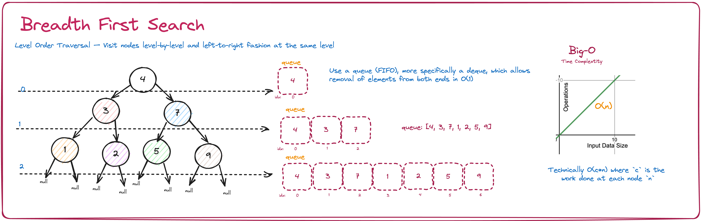

# Intuition

The problem "*[Path Sum](https://leetcode.com/problems/path-sum/)*" asks us to return a bool if a given binary tree has a root-to-leaf path that sums to the given integer.

Since we have a **Binary Tree** and we are looking for an answer that uses a "root-to-leaf" path, my mind jumps to using the either **Breadth First Search** or **Depth First Search** algorithms. Note that there are three sub-types of the DFS algorithm:

- `inorder`: left -> root -> right
- `preorder`: root -> left -> right
- `postorder`: left -> right -> root


BFS searches level by level, recursively. Note that this can be done using a queue/stack.



It is also important to note that we are given a **Binary Tree**, NOT a **Binary SEARCH Tree**. A **Binary Tree** will have nodes that are in unsorted order. Therefore, we will need to search through all of the nodes in the **Binary Tree** using one of traversing algorithms mentioned above.

# Approach

This problem can be solved using either DFS or BFS.

# Algorithm Steps

1. check for the base case: is the root null?
2. check if we are at a leaf node, if so is sum the same at the targetSum?
3. otherwise, recursively call hasPathSum on both the right and left subtrees level by level

# Code

```python
def hasPathSum(self, root, targetSum):
        """
        :type root: TreeNode
        :type targetSum: int
        :rtype: bool
        """
        # BS not BST: meaning search all nodes
        # BFS: level-by-level search
        # base case: check if root is NULL
        if not root:
            return False
        # check: is leaf node -> does the sum match the target?
        if not root.left and not root.right:
            return root.val == targetSum
        return self.hasPathSum(root.right, targetSum - root.val) or self.hasPathSum(root.left, targetSum - root.val)
```

# Complexity

- **Time Compplexity**: `O(n)`, where `n` is the number of nodes in the tree.
- **Space Complexity**: `O(h)`, where `h` is the height of the tree.
