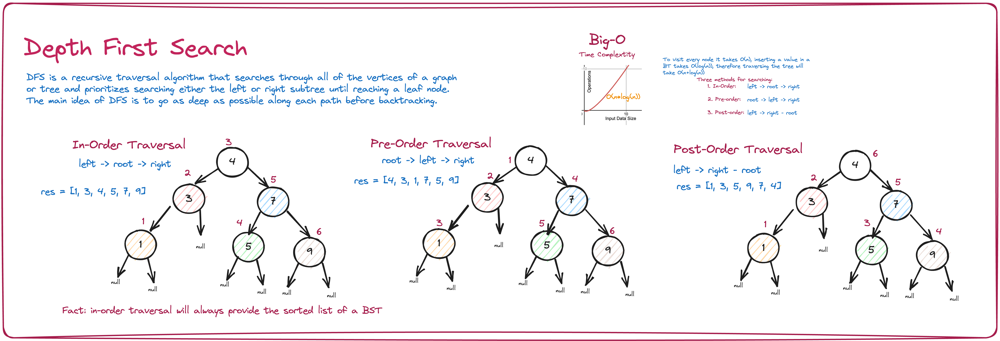

# Intuition

The problem "*[Kth Smallest Element in a BST](https://leetcode.com/problems/kth-smallest-element-in-a-bst/)*" asks us to find the kth smallest element in a Binary Search Tree.

Since we are working with a BST we can use either Depth First Search or Breadth First Search.

# Approach

`DFS` starts with the root node and first visits all nodes of one branch as deep as possible of the chosen Node and before backtracking, it visits all other branches in a similar fashion. There are three sub-types under this are:

- `in-order` (left, root, right),
- `pre-order` (root, left, right), and
- `post-order` (left, right, root) traversal.



`BFS` also starts from the root node and visits all nodes of current depth before moving to the next depth in the tree.


# Algorithm Steps

1. create an inner function: `inorder` which takes the root as input
2. check for base case: is the tree empty? If so, return
3. otherwise, start the inorder traversal: search left, append the root value to the stack, then search right and return
4. call the function `inorder` and pass in the root
5. return the first position (0-indexed) of the stack to get the smallest value in the BST

# Code

```python
# recursive DFS: a in-order traversal of a BST will give us a sorted list
def kthSmallest(self, root, k):
  """
  :type root: TreeNode
  :type k: int
  :rtype: int
  """
  stack = []

  def inorder(root):
    # base case: root is null
    if not root:
      return
    # start search on left subtree, then the right
    inorder(root.left)
    stack.append(root.val)
    inorder(root.right)
    return

  inorder(root) # preform recursive dfs in-order traversal
  return stack[k-1] # return the first node from th e sorted list
```

# Complexity

- **Time Compplexity**: `O()`
- **Space Complexity**: `O(n)`, where `n` is the height of the tree
