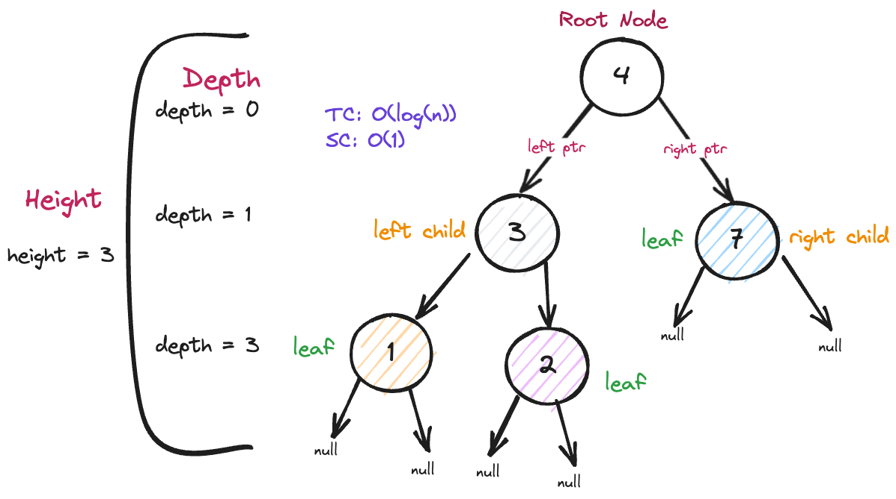

# Intuition

The problem "*[Search in a Binary Search Tree](https://leetcode.com/problems/search-in-a-binary-search-tree/)*" asks us to search through a BST starting from the `root` node and see if `val` exists. If `val` is the same as the currrent node, return the current node, otherwise return `None`.

Searching in a BST is simple, descend to the right if `val` is greater than the current node's value; descend to the left if it's less than. If `val` is the same as the current node's value, return the current node. If we need to descend and there isn't a node where it would have to be, return `None`.

# Approach

Descend through the BST until either `val` is found, or until all nodes have been searched.



# Algorithm Steps

# Code

```python
def searchBST(self, root, val):
    """
    :type root: TreeNode
    :type val: int
    :rtype: TreeNode
    """
    # Given the root of a BST and `val`, find the node whch equals val
    # iterate if root is non-null, searching all decendants
    while root != None and root.val != val:
        #  descend to the right if it's greater
        if root.val < val:
            root = root.right
        #  descend to the right if it's greater
        else:
            root = root.left
    return root
```

# Complexity

- **Time Compplexity**: `O(log(n))`, if the tree is balanced; up to `O(n)` if the nodes are all stretched out in the least balanced fashion.

- **Space Complexity**: `O(1)`, as we are only using two pointers and not using any additional data structures.
